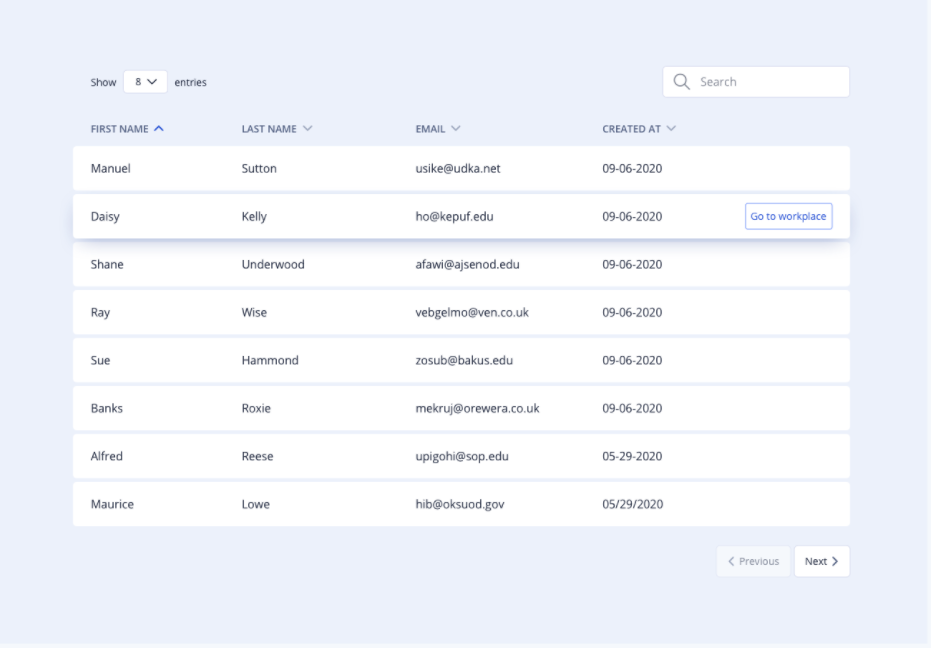
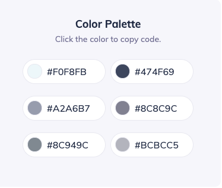

# CSS Flexbox Workshop Assignment

Thank you for Joining CSS Flexbox and Web Design Basics Workshop. Hope you loved it!.

Flexbox basics codesandbox link

https://codesandbox.io/s/flexbox-basics-q497h

Music Player with CSS Flexbox codesandbox link

https://codesandbox.io/s/music-player-with-flexbox-vif1g

## Assignment Instruction

Create Table UI Screen using CSS Flexbox as per mock

Write all of your code in `src/index.html`, `src/style.css`, and `src/index.js`.

### Color Pallete Values

## Bonus Requirement

- Implement Pagination feature(Maximum 10 records per page)
- Implement Search Feature

**Note: No JavaScript Library/Framework is allowed. Implement All the features with vanilla HTML/CSS/JavaScript**

We have added live-server support in this project. that will allow you to see your changes in browser instantly during development.

- Run `npm install` or `yarn` to install packages.

- Run `npm start` or `yarn start` to start the server.

For any queries, please connect with me on [Linkedin](https://www.linkedin.com/in/satyam-bansal/) or Email me at satyam@pesto.tech
